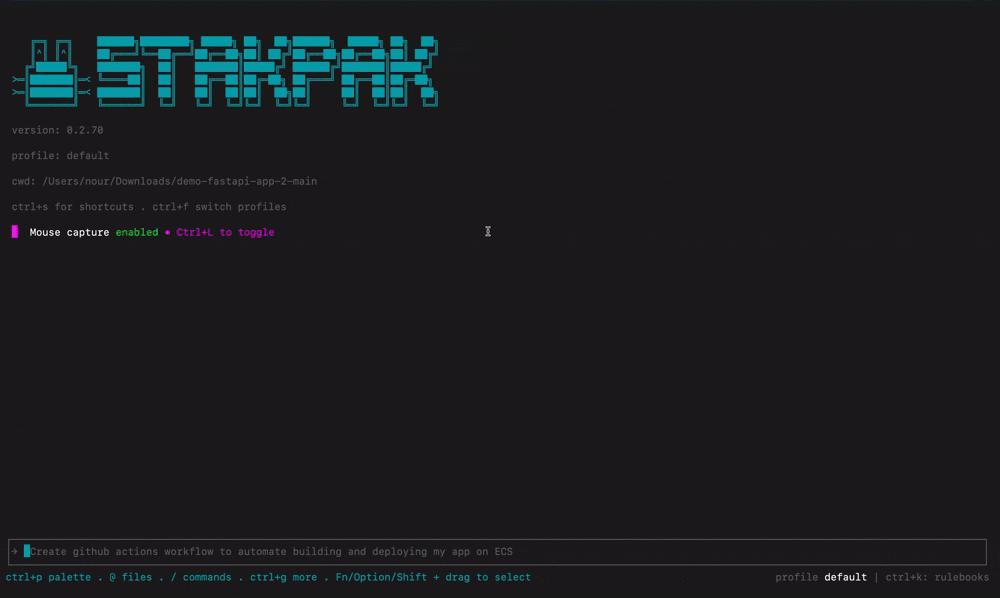

<p align="center">
  <picture>
    <source srcset="assets/stakpak-dark.png" media="(prefers-color-scheme: dark)">
    
  </picture>
</p>

<h3 align="center">Open source AI DevOps Agent in Your Terminal</h3>

<p align="center">
Infrastructure shouldn’t be this hard. Stakpak lets developers secure, deploy, and run infra from the terminal.
</p>

<br />

<!-- Badges Section -->
<p align="center">
  <!-- Built With Ratatui -->
  <a href="https://ratatui.rs/"></a>
  <!-- License -->
  
  <!-- Release (latest GitHub tag) -->
  
  <!-- Build CI status (GitHub Actions) -->
  
  <!-- Downloads (GitHub releases total) -->
  
  <!-- Documentation -->
  <a href="https://stakpak.gitbook.io/docs/"></a>
  <!-- Discord Community -->
  <a href="https://discord.gg/QTZjETP7GB"></a>



</p>

# Stakpak

You can't trust most AI agents with your DevOps. One mistake, and your production is toast.
Stakpak is built different:
- **Secret Substitution** - The LLM works with your credentials without ever seeing them
- **Warden Guardrails** - Network-level policies block destructive operations before they run
- **DevOps Playbooks Baked-in** - Curated library of DevOps knowledge in Stakpak Rulebooks

Generate infrastructure code, debug Kubernetes, configure CI/CD, automate deployments, without giving an LLM the keys to production.


## 🔒 Security Hardened

- **Mutual TLS (mTLS)** - End-to-end encrypted MCP
- **Dynamic Secret Substitution** - AI can read/write/compare secrets without seeing actual values
- **Secure Password Generation** - Generate cryptographically secure passwords with configurable complexity
- **Privacy Mode** - Redacts sensitive data like IP addresses and AWS account IDs

## 🛠️ Built for DevOps Work

- **Asynchronous Task Management** - Run background commands like port forwarding and servers with proper tracking and cancellation
- **Real-time Progress Streaming** - Long-running processes (Docker builds, deployments) stream progress updates in real-time
- **Infrastructure Code Indexing** - Automatic local indexing and semantic search for Terraform, Kubernetes, Dockerfile, and GitHub Actions
- **Documentation Research Agent** - Built-in web search for technical documentation, cloud providers, and development frameworks
- **Subagents** - Specialized research agents for code exploration and sandboxed analysis with different tool access levels (enabled with `--enable-subagents` flag)
- **Bulk Message Approval** - Approve multiple tool calls at once for efficient workflow execution
- **Reversible File Operations** - All file modifications are automatically backed up with recovery capabilities

## 🧠 Adaptive Intelligence

- **Rule Books** - Customize agent behavior with internal standard operating procedures, playbooks, and organizational policies
- **Persistent Knowledge** - Agent learns from interactions, remembers incidents, resources, and environment details to adapt to your workflow

## Installation

### All installation options (Linux, MacOs, Windows)

[Check the docs](https://stakpak.gitbook.io/docs/get-started/installing-stakpak-cli)

### Homebrew (Linux & MacOS)

```bash
brew tap stakpak/stakpak
brew install stakpak
```

To update it you can use

```bash
brew update
brew upgrade stakpak
```

### Binary Release

Download the latest binary for your platform from our [GitHub Releases](https://github.com/stakpak/agent/releases).

### Docker

This image includes the most popular CLI tools the agent might need for everyday DevOps tasks like docker, kubectl, aws cli, gcloud, azure cli, and more.

```bash
docker pull ghcr.io/stakpak/agent:latest
```

## Usage
You can [use your own Anthropic or OpenAI API keys](#option-b-running-without-a-stakpak-api-key), [custom OpenAI compatible endpoint](#option-b-running-without-a-stakpak-api-key), or [a Stakpak API key](#option-a-running-with-a-stakpak-api-key).

### Option A: Running with a Stakpak API Key (no card required)

Just run `stakpak` and follow the instructions which will create a new API key for you.
```bash
stakpak
```

> Brave users may encounter issues with automatic redirects to localhost ports during the API key creation flow. If this happens to you:
>
> Copy your new key from the browser paste it in your terminal

#### You could also set the environment variable `STAKPAK_API_KEY`

```bash
export STAKPAK_API_KEY=<mykey>
```

#### Or save your API key to `~/.stakpak/config.toml`

```bash
stakpak login --api-key $STAKPAK_API_KEY
```

#### View current account (Optional)

```bash
stakpak account
```

### Option B: Running Without a Stakpak API Key

Create `~/.stakpak/config.toml` with one of these configurations:

**Option 1: Bring Your Own Keys (BYOK)** - Use your Anthropic/OpenAI API keys:
```toml
[profiles.byok]
provider = "local"

# customize models
smart_model = "claude-sonnet-4-5"
eco_model = "claude-haiku-4-5"

[profiles.byok.anthropic]
api_key = "sk-ant-..."

[profiles.byok.openai]
api_key = "sk-..."

[profiles.byok.gemini]
api_key = "sk-..."

[settings]
```

**Option 2: Bring Your Own LLM** - Point to a local OpenAI-compatible endpoint (e.g. LM Studio):
```toml
[profiles.offline]
provider = "local"
smart_model = "qwen/qwen3-coder-30b"
eco_model = "qwen/qwen3-coder-30b"

[profiles.offline.openai]
api_endpoint = "http://127.0.0.1:1234/v1/chat/completions"
api_key = ""

[settings]
```

Then run with your profile:
```bash
stakpak --profile byok
# or
stakpak --profile offline
```

### Start Stakpak Agent TUI

```bash
# Open the TUI
stakpak
# Resume execution from a checkpoint
stakpak -c <checkpoint-id>
```

### Start Stakpak Agent TUI with Docker

```bash
docker run -it --entrypoint stakpak ghcr.io/stakpak/agent:latest
# for containerization tasks (you need to mount the Docker socket)
docker run -it \
   -v "/var/run/docker.sock":"/var/run/docker.sock" \
   -v "{your app path}":"/agent/" \
   --entrypoint stakpak ghcr.io/stakpak/agent:latest
```

### Keyboard Shortcuts


- Use `Arrow keys` or **Tab** to select options
- Press `Esc` to exit the prompt
- `?` for Shortcuts
- `/` for commands
- `↵` to send message
- `Shift + Enter` or `Ctrl + J` to insert newline
- `Ctrl + C` to quit

### MCP Modes

You can use Stakpak as a secure MCP proxy or expose its security-hardened tools through an [MCP](https://modelcontextprotocol.io/) server.

#### MCT Server Tools

- **Local Mode (`--tool-mode local`)** - File operations and command execution only (no API key required)
- **Remote Mode (`--tool-mode remote`)** - AI-powered code generation and search tools (API key required)
- **Combined Mode (`--tool-mode combined`)** - Both local and remote tools (default, API key required)

#### Start MCP Server

```bash
# Local tools only (no API key required, mTLS enabled by default)
stakpak mcp start --tool-mode local

# Remote tools only (AI tools optimized for DevOps)
stakpak mcp start --tool-mode remote

# Combined mode (default - all tools with full security)
stakpak mcp start

# Disable mTLS (NOT recommended for production)
stakpak mcp start --disable-mcp-mtls
```

Additional flags for the MCP server:

- `--disable-secret-redaction` – **not recommended**; prints secrets in plaintext to the console
- `--privacy-mode` – redacts additional private data like IP addresses and AWS account IDs
- `--enable-slack-tools` – enables experimental Slack tools

#### MCP Proxy Server

Stakpak also includes an MCP proxy server that can multiplex connections to multiple upstream MCP servers using a configuration file.

```bash
# Start MCP proxy with automatic config discovery
stakpak mcp proxy

# Start MCP proxy with explicit config file
stakpak mcp proxy --config-file ~/.stakpak/mcp.toml

# Disable secret redaction (NOT recommended – secrets will be printed in logs)
stakpak mcp proxy --disable-secret-redaction

# Enable privacy mode to redact IPs, account IDs, etc.
stakpak mcp proxy --privacy-mode
```

### Agent Client Protocol (ACP)

ACP is a standardized protocol that enables AI agents to integrate directly with code editors like Zed, providing seamless AI-powered development assistance.

#### What ACP Offers with Stakpak

- **Real-time AI Chat** - Natural language conversations with context-aware AI assistance
- **Live Code Analysis** - AI can read, understand, and modify your codebase in real-time
- **Tool Execution** - AI can run commands, edit files, search code, and perform development tasks
- **Session Persistence** - Maintains conversation context across editor sessions
- **Streaming Responses** - Real-time AI responses with live progress updates
- **Agent Plans** - Visual task breakdown and progress tracking

#### Installation & Setup

1. **Install Stakpak** (if not already installed)
2. **Configure Zed Editor** - Add to `~/.config/zed/settings.json`:

```json
{
  "agent_servers": {
    "Stakpak": {
      "command": "stakpak",
      "args": ["acp"],
      "env": {}
    }
  }
}
```

3. **Start ACP Agent**:

```bash
stakpak acp
```

4. **Use in Zed** - Click Assistant (✨) → `+` → `New stakpak thread`

### Rulebook Management

Manage your standard operating procedures (SOPs), playbooks, and runbooks with Stakpak Rulebooks. Rulebooks customize agent behavior and provide context-specific guidance.

```bash
# List all rulebooks
stakpak rulebooks get
# or use the short alias
stakpak rb get

# Get a specific rulebook
stakpak rb get stakpak://my-org/deployment-guide.md

# Create or update a rulebook from a markdown file
stakpak rb apply my-rulebook.md

# Delete a rulebook
stakpak rb delete stakpak://my-org/old-guide.md
```

#### Rulebook Format

Rulebooks are markdown files with YAML frontmatter:

```markdown
---
uri: stakpak://my-org/deployment-guide.md
description: Standard deployment procedures for production
tags:
  - deployment
  - production
  - sop
---

# Deployment Guide

Your deployment procedures and guidelines here...
```

## Platform Testing

### Windows

Comprehensive testing report for Windows CLI functionality, including installation, configuration, and integration with WSL2 and Docker.

[View Windows Testing Report](platform-testing/windows-testing-report.md)

---

## ⭐ Like what we're building?

If our Agent saves you time or makes your DevOps life easier,  
**consider giving us a star on GitHub — it really helps!**

## [](https://github.com/stakpak/agent/stargazers)
